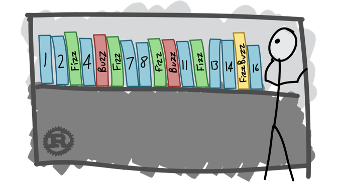

# Übung 1: Red => Green => Refactor


## Das FizzBuzz Spiel


### Aufgaben:
- Erstellen Sie eine Klasse FizzBuzzGame in einem neuen Consolen Projekt.
- Fügen Sie dieser Klasse eine Methode GetResponse() hinzu:
```
public object GetResponse(int number)
{
	throw new NotImplementedException();
}
```
- Lassen Sie über das Kontextmenü ein (xUnit?) Komponententest Project erstellen.
- Erstellen Sie eine neue TestMethode nach dem AAA Schema:
```
[Fact]
public void GetResponse_given_1_then_1()
{
    // Arrange
    var game = new FizzBuzzGame();
        
    // Act
    var result = game.GetResponse(1);

    // Assert
    Assert.Equal(1, result);
} 
```
- Lassen Sie den Test ausführen (Test-> Alle Tests ausführen)
- Red => Der Test sollte jetzt rot sein.
- Green => Ändern Sie die Methode GetResponse() so, dass der Test grün wird.
- Refactor => (Optional) Ändern Sie den Code, so dass er einfach verständlich ist.


