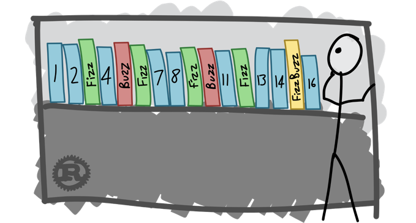

# Test Driven Design

## TDD usually follows the "Red-Green-Refactor" cycle:

- Add a test to the test suite
- (Red) Run all the tests to ensure the new test fails
- (Green) Write just enough code to get that single test to pass
- Run all tests
- (Refactor) Improve the initial code while keeping the tests green
- Repeat


## Übung: Das FizzBuzz Spiel

[FizzBuzz Kata](https://yoan-thirion.gitbook.io/knowledge-base/software-craftsmanship/code-katas/tdd-katas/fizzbuzz)<p>
- Für Vielfache von 3 ist das Ergebnis "Fizz"
- Für Vielfache von 5 ist das Ergebnis "Buzz"
- Für Vielfache von 15 ist das Ergebnis "FizzBuzz"
- Ansonsten ist das Ergebnis die ursprüngliche Zahl
### Aufgaben:
- Erstellen Sie in einem neuen Consolen Projekt die Klasse FizzBuzzGame.
- Fügen Sie dieser Klasse eine Methode GetResponse() hinzu:
```
public object GetResponse(int number)
{
	throw new NotImplementedException();
}
```
- Lassen Sie über das Kontextmenü ein (xUnit?) Komponententest Project generieren.
- Erstellen Sie eine neue TestMethode nach dem "AAA" Schema:
```
[Fact]
public void GetResponse_given_1_then_1()
{
    // Arrange
    var game = new FizzBuzzGame();
        
    // Act
    var result = game.GetResponse(1);

    // Assert
    Assert.Equal(1, result);
} 
```
- Lassen Sie den Test ausführen (Test-> Alle Tests ausführen)
- Red => Der Test sollte jetzt rot sein.
- Green => Ändern Sie die Methode GetResponse() so, dass der Test grün wird.
- Refactor => (Optional) Ändern Sie den Code, so dass er möglichst einfach ist.<p>
- Erweitern Sie den Code für "Fizz" (Red => Green => Refactor!).
- Erweitern Sie den Code für "Buzz" (Red => Green => Refactor!).
- Erweitern Sie den Code für "FizzBuzz" (Red => Green => Refactor!).
- Erstellen Sie einen parametrisierten Test (mit [Theory] und [InlineData(...)]) der alle bisherigen Fälle abdeckt.
- Zahlen kleiner 1 oder größer 100 werfen eine ArgumentException (Red => Green => Refactor).
- Wie ist die aktuelle Test Coverage?


