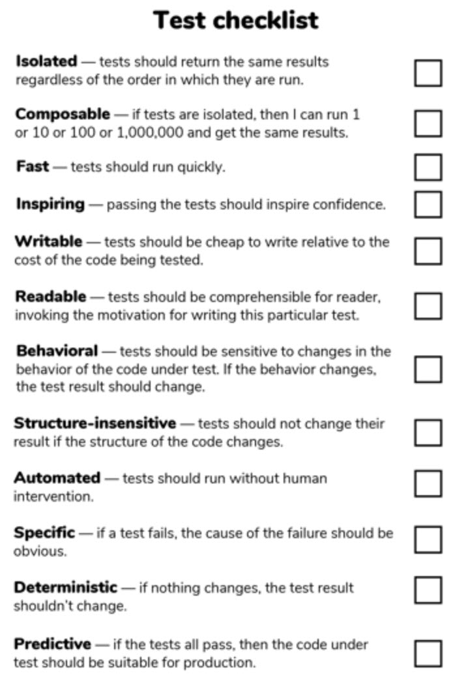

# Red, Green, Refactor
- Add a test
- Run all tests and see if the new one fails - Red
- Write the minimum amount of code to pass the failing test - 
- Run tests - Green
- Refactor code - Blue 
- ***Repeat***

# TDD Golden Rule
***Do not write any production code until you have a failing test that requires it!***

# Arrange, Act, Assert
- Arrange :
	- Setup everything needed for the testing code
	- Data initialization / mocks
- Act :
	- Invoke the code under test / behavior
- Assert :
	- Specify the pass criteria for the test

# Define a test checklist for your team :

