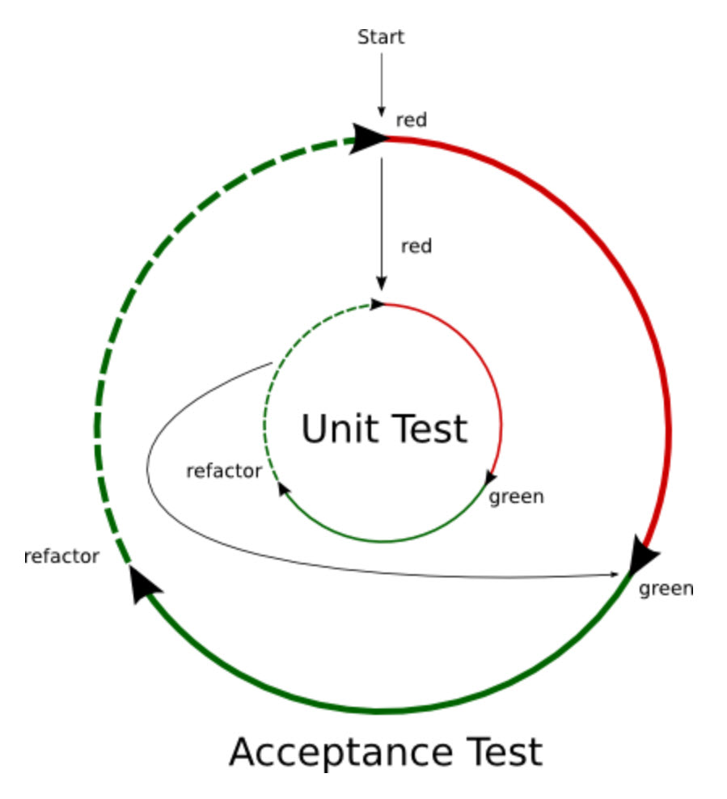

# Übung 2: Outside-In TDD

## In outside-in TDD we only implement what is needed to serve the outside.
- Write an acceptance test that fails
	- Something that can be accepted by a stakeholder			
	- The feature test
- Keep it red	
	- It will indicate what to test
	- Drive to the next step

- ***This double loop continues till the feature test turns green***


## Aufgabe
- Erstellen Sie einen roten Acceptance Test für die Klasse Konto, der folgenden Kontoauszug ausgibt:
```
Datum         Betrag     Saldo
01.01.2023    100,00    100,00
01.01.2023    -50,00     50,00
 ```
- Verwenden Sie hierfür einen Approval Test (nuget Pakete ApprovalTests und ApprovalUtilities)
- Warum wird der Acceptance Test jetzt rot?
- Erstellen Sie nacheinander Unit Tests für alle Methoden der Klasse Konto, die Sie benötigen, um den Acceptance Test grün zu bekommen.
	- Erstellen sie jeweils einen Unit Test und implementieren Sie dann die Methode.
