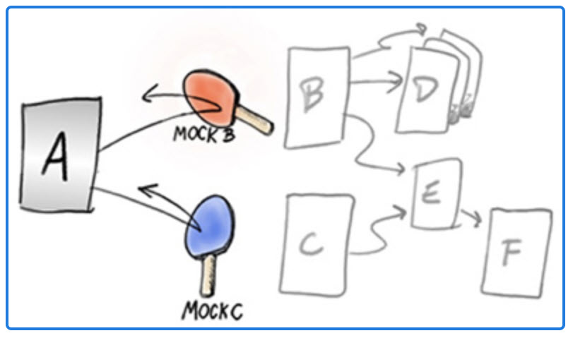

# Test Doubles

## Test Doubles sind Stellvertreter für echte Objekte

- Ermöglichen das isolierte Testen von Klassen
- Können das Verhalten von echten Objekten nachahmen
- Können das Verhalten von echten Objekten überwachen
- Können das Verhalten von echten Objekten simulieren

## Arten von Test Doubles
- Stub
	- Einfacher Stellvertreter, damit der Code kompiliert
- Fake	
	- Manuell codierter Stellvertreter
- Mock
	- Kann Erwartungen prüfen
	- Wird meistens über eine Mocking Bibliothek generiert

## Martin Fowler described a great comparison between Stubs and Mocks in the article "Mocks Aren't Stubs":

https://martinfowler.com/articles/mocksArentStubs.html

There are several types of pretend object used in place of a real object for testing purposes:

- Dummy objects are passed around but never actually used. Usually they are just used to fill parameter lists.
- Fake objects actually have working implementations, but usually take some shortcut which makes them not suitable for
  production (an in memory database is a good example).
- Stubs provide canned answers to calls made during the test, usually not responding at all to anything outside what's
  programmed in for the test.
- Spies are stubs that also record some information based on how they were called. One form of this might be an email
  service that records how many messages it was sent.
- Mocks objects pre-programmed with expectations which form a specification of the calls they are expected to receive.